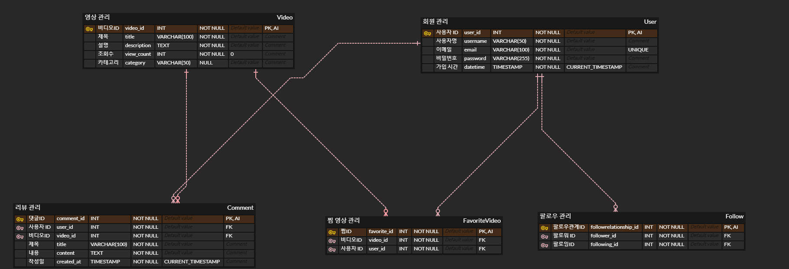

# PJT5-C

## **PJT5-C 프로젝트 명세서**

---

### **1. 프로젝트 개요**

**프로젝트명:** SSAFIT_DB  
**참여 인원:** 정우, 재현, 혜민  
**프로젝트 유형:** MySQL 활용 DataBase 구축  

#### **협업 log**  
- 11:00 ~ 12:00 Live 복습, 프로젝트 아이디어 논의 및 역할 분담  
- 12:00 ~ 13:00 ERD 설계 초안 작성  
- 14:00 ~ 15:00 데이터베이스 스키마 및 데이터 생성  
- 15:00 ~ 15:30 README.md 파일 제작  

---

### **2. ERD 세부 설명 및 관계**

아래는 SSAFIT_DB의 ERD입니다. 이 데이터베이스는 사용자 관리, 비디오 관리, 댓글, 즐겨찾기 비디오 및 팔로우 관계를 포함하고 있습니다. 

#### **1. User Table**

- **목적**: 사용자 정보를 저장하는 테이블입니다.
- **주요 필드**:
  - `user_id`: 사용자의 고유 식별자 (Primary Key). 자동 증가(AUTO_INCREMENT) 설정되어 있으며, 중복 불가능합니다.
  - `username`: 사용자의 이름. NULL 불가능합니다.
  - `email`: 사용자의 이메일 주소. UNIQUE 제약 조건이 있으며, 중복된 이메일이 등록될 수 없습니다.
  - `password`: 사용자의 비밀번호. NULL 불가능합니다.
  - `datetime`: 사용자의 가입 일시. 기본값으로 현재 시간을 설정(CURRENT_TIMESTAMP)합니다.

#### **2. Video Table**

- **목적**: 비디오 정보를 저장하는 테이블입니다.
- **주요 필드**:
  - `video_id`: 비디오의 고유 식별자 (Primary Key). 자동 증가(AUTO_INCREMENT) 설정되어 있습니다.
  - `title`: 비디오의 제목. NULL 불가능합니다.
  - `description`: 비디오의 설명. NULL 불가능합니다.
  - `view_count`: 비디오 조회 수. 기본값으로 0을 설정하며, NULL 불가능합니다.
  - `category`: 비디오의 카테고리. NULL 허용됩니다.

#### **3. Comment Table**

- **목적**: 비디오에 대한 댓글 정보를 저장하는 테이블입니다.
- **주요 필드**:
  - `comment_id`: 댓글의 고유 식별자 (Primary Key). 자동 증가(AUTO_INCREMENT) 설정되어 있습니다.
  - `user_id`: 댓글 작성자의 사용자 ID (Foreign Key). `User` 테이블의 `user_id`를 참조합니다.
  - `video_id`: 댓글이 달린 비디오의 ID (Foreign Key). `Video` 테이블의 `video_id`를 참조합니다.
  - `title`: 댓글 제목. NULL 불가능합니다.
  - `content`: 댓글 내용. NULL 불가능합니다.
  - `created_at`: 댓글 작성 일시. 기본값으로 현재 시간을 설정(CURRENT_TIMESTAMP)합니다.

- **제약 조건**: 
  - `user_id`는 `User` 테이블의 `user_id`를 외래 키로 참조하며, 이는 사용자가 존재해야만 댓글을 작성할 수 있음을 보장합니다.
  - `video_id`는 `Video` 테이블의 `video_id`를 외래 키로 참조하여, 댓글이 반드시 존재하는 비디오에 달려야 함을 보장합니다.

#### **4. FavoriteVideo Table**

- **목적**: 사용자가 즐겨찾기한 비디오 정보를 저장하는 테이블입니다.
- **주요 필드**:
  - `favorite_id`: 즐겨찾기의 고유 식별자 (Primary Key). 자동 증가(AUTO_INCREMENT) 설정되어 있습니다.
  - `video_id`: 즐겨찾기한 비디오의 ID (Foreign Key). `Video` 테이블의 `video_id`를 참조합니다.
  - `user_id`: 즐겨찾기한 사용자의 ID (Foreign Key). `User` 테이블의 `user_id`를 참조합니다.

- **제약 조건**:
  - `video_id`는 `Video` 테이블의 `video_id`를 외래 키로 참조하여, 즐겨찾기한 비디오가 반드시 존재해야 함을 보장합니다.
  - `user_id`는 `User` 테이블의 `user_id`를 외래 키로 참조하여, 즐겨찾기한 사용자가 반드시 존재해야 함을 보장합니다.

#### **5. Follow Table**

- **목적**: 사용자 간의 팔로우 관계를 관리하는 테이블입니다.
- **주요 필드**:
  - `followrelationship_id`: 팔로우 관계의 고유 식별자 (Primary Key). 자동 증가(AUTO_INCREMENT) 설정되어 있습니다.
  - `follower_id`: 팔로우하는 사용자의 ID (Foreign Key). `User` 테이블의 `user_id`를 참조합니다.
  - `following_id`: 팔로우되는 사용자의 ID (Foreign Key). `User` 테이블의 `user_id`를 참조합니다.

- **제약 조건**:
  - `follower_id`는 `User` 테이블의 `user_id`를 외래 키로 참조하여, 팔로우하는 사용자가 반드시 존재해야 함을 보장합니다.
  - `following_id`는 `User` 테이블의 `user_id`를 외래 키로 참조하여, 팔로우되는 사용자가 반드시 존재해야 함을 보장합니다.

---

### **3. 역할 분담**

- 정우: 생성형 AI를 활용한 schema 개선 및 data 생성
- 재현: 프로젝트 과정 구조화 ERD 초안 작성  
- 혜민: ERD 검토 및 구체화 개념 설명해주는 족집게 강사님!

